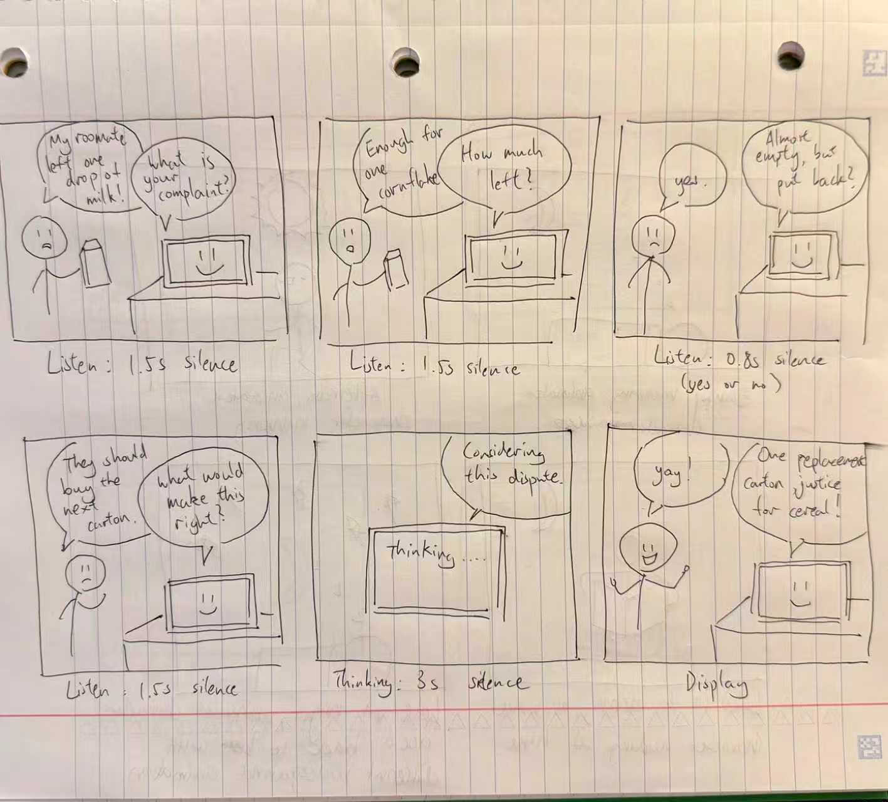

# Chatterboxes

**NAMES OF COLLABORATORS HERE**

Hong Yuan Cao hc2343, Yun-Chung Liu yl4445

[](https://www.youtube.com/embed/Q8FWzLMobx0?start=19)

In this lab, we want you to design interaction with a speech-enabled device — something that listens and talks to you. This device can do anything *but* control lights (since we already did that in Lab 1). First, we want you to storyboard what you imagine the conversational interaction to be like. Then you will use wizarding techniques to elicit examples of what people might say, ask, or respond. We then want you to use the examples collected from at least two other people to inform the redesign of the device.

We will focus on **audio** as the main modality for interaction to start; these general techniques can be extended to **video**, **haptics** or other interactive mechanisms in the second part of the Lab.

A note on what you are building with. Speech interfaces are usually taught as two boxes — speech-in, speech-out — and that framing hides the part that actually determines whether an interaction works. Between listening and speaking sits the question of **whose turn it is**: when does the device decide you have finished talking, and how long does it make you wait before it answers? This lab gives you direct control over both, and we will ask you to notice what changes when you move them.

## Prep for Part 1: Get the Latest Content and Pick up Additional Parts

Please check instructions in [prep.md](prep.md) and complete the setup.

### Pick up Web Camera If You Don't Have One

Students who have not already received a web camera will receive their Webcam and at the beginning of lab. If you cannot make it to class this week, please contact the TAs to ensure you get these.

### Get the Latest Content

As always, pull updates from the class Interactive-Lab-Hub to both your Pi and your own GitHub repo.

**\[recommended\]** Option 1: On the Pi, `cd` to your `Interactive-Lab-Hub`, pull the updates from upstream (class lab-hub) and push the updates back to your own GitHub repo. You will need the *personal access token* for this.

```
pi@ixe00:~$ cd Interactive-Lab-Hub
pi@ixe00:~/Interactive-Lab-Hub $ git pull upstream Fall2026
pi@ixe00:~/Interactive-Lab-Hub $ git add .
pi@ixe00:~/Interactive-Lab-Hub $ git commit -m "get lab3 updates"
pi@ixe00:~/Interactive-Lab-Hub $ git push
```

Option 2: On your own GitHub repo, create a pull request to get updates from the class Interactive-Lab-Hub. After you have the latest updates online, go to your Pi, `cd` to your `Interactive-Lab-Hub` and use `git pull`.

---

# Part 1

## Setup

Create and activate a virtual environment for this lab:

```
pi@ixe00:~$ cd Interactive-Lab-Hub/Lab\ 3
pi@ixe00:~/Interactive-Lab-Hub/Lab 3 $ python3 -m venv .venv
pi@ixe00:~/Interactive-Lab-Hub/Lab 3 $ source .venv/bin/activate
(.venv) pi@ixe00:~/Interactive-Lab-Hub/Lab 3 $
```

Install the Python dependencies:

```
(.venv) $ pip install -r requirements.txt
```

This takes a few minutes. If you would like it to take considerably less time, [`uv`](https://docs.astral.sh/uv/) is a drop-in replacement for `pip` that is dramatically faster on the Pi:

```
(.venv) $ pip install uv && uv pip install -r requirements.txt
```

Then run the setup script, which installs the classic speech synthesizers, downloads the voice activity detection model, and pre-fetches a neural voice and a speech recognition model so you are not waiting on downloads during lab:

```
(.venv):~$ cd speech-scripts
(.venv) $ ./setup.sh
```

Check your audio devices before going further. `arecord -l` lists capture devices and `aplay -l` lists playback devices; if your webcam microphone or Bluetooth speaker does not appear, fix that first — every script below assumes the system defaults are the ones you want.

## A. Text to Speech

Your Pi can speak in several quite different ways, and the differences are audible in a way that matters for design. In `speech-scripts/` there are shell scripts for each.

### The classic engines

```
(.venv) $ cd speech-scripts

(.venv) $ sudo apt update
(.venv) $ sudo apt install -y espeak festival festvox-kallpc16k

(.venv) $ ./espeak_demo.sh
(.venv) $ ./festival_demo.sh
```

You can run these `.sh` files by typing `./filename`, and read one with `cat filename`. You can also play audio files directly with `aplay filename` — try `aplay lookdave.wav`.

These are all decades-old technology and they sound like it. `espeak-ng` is a *formant synthesizer*: it generates speech from an acoustic model of the vocal tract, which is why it sounds robotic but also why the whole thing fits in a couple of megabytes and responds instantly. `festival` is *concatenative*: they stitch together recorded fragments of a real speaker, which sounds more human but breaks audibly at the seams.

### Neural TTS with Piper

Note that the Piper command line changed in version 1.x — voices are now downloaded explicitly with `python3 -m piper.download_voices`, and you invoke it as `python3 -m piper`. Tutorials you find online may show the old `echo ... | piper --model ...` form, which no longer works. Browse the [voice samples](https://rhasspy.github.io/piper-samples) and download a different one if you'd like:

```
(.venv) $ python3 -m piper.download_voices en_US-lessac-medium
```

[Piper](https://github.com/OHF-Voice/piper1-gpl) synthesizes speech with a small neural network, runs comfortably on the Pi 5, and sounds markedly better than the above.

```
(.venv) $ ./piper_demo.sh
```

The demo script also shows `--output-raw`, which streams audio to the speaker as it is generated rather than writing a file first. Listen for the difference in how quickly speech begins. In a conversational system this gap is the thing your user experiences as responsiveness.

\*\***Write your own shell file to use your favorite of these TTS engines to have your Pi greet you by name.**\*\*
(This shell file should be saved to your own repo for this lab.)

File called: greet_my_name.sh

\*\***Then answer: Is the same greeting, in these different voices, the same greeting? Describe one concrete way the voice changed what the utterance seemed to mean or who seemed to be speaking.**\*\*

I used the same Piper voice as the demo for my greeting script: both sounded natural and conversational. However, compared with Piper, eSpeak and Festival sounded much more robotic. Even with the same words, the Piper greeting felt more like a person checking in with me, while the other two felt more like a machine delivering a message.

## B. Speech to Text

We use [faster-whisper](https://github.com/SYSTRAN/faster-whisper), a reimplementation of OpenAI's Whisper model that runs several times faster on CPU and does not require PyTorch. All processing happens on the Pi; nothing is sent to a server.

```
(.venv) $ python transcribe.py lookdave.wav
```

The transcript is not the interesting output here — the timings are. Run it again with a larger model and compare:

```
(.venv) $ python transcribe.py lookdave.wav --model base.en
(.venv) $ python transcribe.py lookdave.wav --model small.en
#  noted that the first run may take longer because the model is downloaded, and that the HF unauthenticated-request warning is expected and not an error.
```

Available sizes, smallest first: `tiny.en`, `base.en`, `small.en`, `medium.en`. The `.en` variants are English-only and faster than their multilingual counterparts at the same size.

\*\***Record a few seconds of your own speech (`arecord -d 5 -f cd -c 1 -r 16000 test.wav`) and transcribe it with at least two model sizes. Report the real-time factor for each. At what point does the accuracy improvement stop being worth the delay, for a system that has to answer you?**\*\*

For my five-second recording, base.en took 0.72 seconds to load and 1.96 seconds to transcribe, with a real-time factor of 0.39x. small.en took 197.03 seconds to load and 5.66 seconds to transcribe, with a real-time factor of 1.13x. Both produced the same words, with only a punctuation difference. The small model’s startup wait was especially noticeable. Although loading happens only once in a continuously running system, its transcription was also slower without improving accuracy on this recording. I would easily choose base.en for faster startup and conversational responses.

\*\***Write your own script that verbally asks for a numerical input (a phone number, zipcode, number of pets) and records the answer the respondent provides.**\*\* Numbers are a good stress test — transcription systems make characteristic errors on digit strings, and you will want to know what they are before you design around them.

My script uses Piper to ask “How many coffees did you drink today?” and then records a five-second response. Testing with base.en produced the transcript “1,” taking 1.66 seconds with a real-time factor of 0.33x.

## C. Turn-taking: knowing when someone has stopped talking

Everything so far has worked on fixed audio files. A real conversational device does not get told when to start and stop recording — it has to decide. This is the problem that makes speech interfaces hard, and it is mostly not a speech recognition problem.

We use a **voice activity detector** (VAD) to segment the microphone stream into utterances. `listen.py` runs Silero VAD continuously and hands each detected utterance to faster-whisper:

```
(.venv) $ cd speech-scripts
(.venv) $ python listen.py
```

Speak, pause, and watch it transcribe. Now change the endpointing threshold — the amount of silence the system requires before it decides your turn is over:

```
(.venv) $ python listen.py --min-silence 0.2
(.venv) $ python listen.py --min-silence 1.5
```

\*\***Try both extremes, and something in between. Describe what each one feels like to talk to. Note specifically: at 0.2s, what kinds of normal speech get cut off? At 1.5s, what does the delay make the system seem like?**\*\*

### Our observations

We tested silence thresholds of 0.2s, 0.4s (the default), and 1.5s using `listen.py`. These runs used the script's default `tiny.en` recognition model.

At 0.2s, the system often split our speech into short fragments instead of capturing full sentences. Pausing within a sentence could end the turn before we finished our thought, making it difficult to speak naturally. The intermediate 0.4s setting also produced many short fragments, so it did not fully solve this problem. At 1.5s, the system captured longer phrases, including hesitations and changes of thought, but required a longer wait before deciding we were finished. This gives the speaker more room to think, at the cost of making the system seem slower to respond.

We also noticed that the beginning of our speech was often missing at both short and long settings. Increasing the end-of-turn silence threshold did not resolve that observation. The transcripts alone cannot establish whether the first words were lost during audio capture, speech detection, or recognition; we would need the original audio and intended words to identify the cause.

**0.2s minimum silence:**

```text
[0.5s speech, 0.86s to transcribe]  Hello.
[0.6s speech, 0.91s to transcribe]  Are you doing?
[0.8s speech, 0.84s to transcribe]  the microphone.
[1.1s speech, 4.64s to transcribe]  We have some one refill.
[0.4s speech, 0.75s to transcribe]  Yeah.
```

**0.4s minimum silence (default):**

```text
[0.7s speech, 0.80s to transcribe]  Hello.
[0.4s speech, 0.80s to transcribe]  you.
[0.7s speech, 0.78s to transcribe]  Are you?
[0.5s speech, 0.82s to transcribe]  Eric.
[0.8s speech, 0.89s to transcribe]  How was your day?
[0.4s speech, 0.79s to transcribe]  Why?
[0.6s speech, 3.99s to transcribe]  y'all.
[1.2s speech, 6.31s to transcribe]  We will see you next time.
[0.5s speech, 0.86s to transcribe]  doesn't work.
```

**1.5s minimum silence:**

```text
[2.7s speech, 1.23s to transcribe]  And I think... No, no, I don't think I'll talk about it either.
[2.6s speech, 1.10s to transcribe]  I think I should know maybe it's September 28th something like that
[2.7s speech, 1.18s to transcribe]  That's true, we're looking at I think it's a number of times
[4.4s speech, 1.07s to transcribe]  very cool. What if I don't think that?
[1.3s speech, 0.83s to transcribe]  the air.
[0.6s speech, 0.88s to transcribe]  hungry.
[3.9s speech, 1.01s to transcribe]  very very hungry I need to eat food
[0.5s speech, 0.82s to transcribe]  No.
```

### The complete loop

`echo_bot.py` puts the pieces together: it listens, endpoints, transcribes, and speaks a reply through Piper. The dialogue policy is deliberately trivial — it repeats what you said — so that everything you notice is a property of the timing rather than the content.

```
(.venv) $ python echo_bot.py
```

## D. Storyboard

### Tiny Court of Everyday Disputes

Our device hears small everyday complaints and gives humorous verdicts. The storyboard shows a student complaining about a roommate returning an almost-empty milk carton to the fridge. Read the panels from left to right across the top row, then the bottom row.



### Design process

We explored playful speech-device ideas and chose a tiny courtroom because it gives people a clear reason to speak while leaving room for unexpected answers.

We organized the interaction into six steps: hearing the complaint, gathering evidence, confirming understanding, asking for a solution, deliberating, and delivering a verdict. The confirmation step lets the user correct a misunderstanding before the judge decides. The milk case is one possible conversation; during role-play, the judge can follow the same structure while adapting its questions to the participant's own complaint.

### Dialogue and pauses

1. **Hear the complaint.** The judge asks, “What is your complaint?” The user answers, “My roommate left one drop of milk!” The device waits for **1.5 seconds of silence** after the answer.
2. **Gather evidence.** The judge asks, “How much left?” The user replies, “Enough for one cornflake.” The device again waits for **1.5 seconds of silence**.
3. **Confirm understanding.** The judge asks, “Almost empty, but put back?” The user says, “Yes.” For this short confirmation, the device waits for **0.8 seconds of silence**. If the user starts explaining a correction, the intended behavior is to allow the longer 1.5-second pause instead.
4. **Ask for a solution.** The judge asks, “What would make this right?” The user answers, “They should buy the next carton.” The device waits for **1.5 seconds of silence**, allowing room for a brief pause while thinking through an answer.
5. **Deliberate.** The judge says, “Considering this dispute,” and displays “Thinking…” during a deliberate **three-second pause**.
6. **Deliver the verdict.** The judge announces, “One replacement carton. Justice for cereal!” The user responds, “Yay!” The device displays the verdict.

Our listening pauses are informed by Part C, where short silence thresholds often split our speech into fragments. We chose 1.5 seconds for open-ended answers so users have more room to hesitate, and 0.8 seconds as an initial setting for a short confirmation. These thresholds measure silence after speech, not the total time allowed for an answer. The separate three-second deliberation pause creates suspense, while “Thinking…” explains why the device has not replied yet. These are proposed timings to test and adjust during the role-play, and for when we actually build this out.

## E. Acting out the dialogue

**[▶ Watch our Tiny Court role-play](https://github.com/eliu1122/Interactive-Lab-Hub/blob/Fall2026/Lab%203/Video%20of%20Raspberry%20Judge.mp4)** — the recording is in this folder as `Video of Raspberry Judge.mp4`, and GitHub plays it in its file viewer.

Find a partner, and *without sharing the script with your partner* try out the dialogue you've designed, where you (as the device designer) act as the device you are designing. Please record this interaction (for example, using Zoom's record feature).

\*\***Describe if the dialogue seemed different than what you imagined when it was acted out, and how.**\*\*

Acting it out was messier than the storyboard made it look. On paper every answer is one clean line, but out loud our partner gave longer answers with pauses in the middle of them, and the confirmation step was the clearest problem: instead of just saying "yes" they started explaining, so the 0.8 second threshold we had planned would have cut them off. The three second thinking pause also felt much longer spoken than it looked in the panel, and it only worked once we said "Thinking" out loud, otherwise it just seemed like the device had frozen. The verdict, on the other hand, landed better than we expected, because saying it in a formal judge voice got a real laugh that the drawing could not show.

---

# Lab 3 Part 2

For Part 2, you will redesign the interaction with the speech-enabled device using the data collected, as well as feedback from part 1.

## Prep for Part 2

1. What are concrete things that could use improvement in the design of your device? For example: wording, timing, anticipation of misunderstandings.
2. What are other modes of interaction *beyond speech* that you might also use to clarify how to interact? In particular: how does someone know when the device is listening, and when it is thinking? You have a screen and an LED.
3. Make a new storyboard, diagram and/or script based on these reflections.
4. (optional) Integrate [input devices](inputs.md) in the system

### Our answers

**1. What could be improved?**

- **Wording:** Questions now say exactly what they mean, like "Did your roommate ask before taking the charger?" instead of "How much left?"
- **Timing:** The judge waits a little longer (1.2 seconds) before deciding a yes or no answer is finished, so people are not cut off.
- **Misunderstandings:** If the judge hears nothing, it asks you to say it again. If it cannot tell whether you said yes or no, it asks again.

**2. How do people know when it is listening or thinking?**

The screen changes color and shows a word:

- **Amber, "THE JUDGE":** the judge is talking.
- **Green, "LISTENING":** your turn to talk.
- **Purple, "THINKING...":** the judge is working on your answer.

We used the screen instead of the LED because a word is clearer than a light.

**3. New script**

How a case goes:

1. Press the top button to start.
2. The judge asks for your complaint.
3. It asks a few questions about what happened.
4. It thinks for 3 seconds.
5. It gives a verdict: fair, unfair, or split.

The judge handles three kinds of complaint: a borrowed charger, eaten food, and chores. The full script is in [cases.py](mini_judge/cases.py).

**4. Input devices**

The top button on the screen starts a case, and a USB microphone hears your answers.

## Prototype your system

The system should:
* use the Raspberry Pi
* use one or more sensors
* require participants to speak to it

*Document how the system works.*

*Include videos or screencaptures of both the system and the controller.*

### How it works

Press the top button and the judge asks questions out loud. It listens until you pause, turns your answer into text, and moves on. It works out the type of complaint from the words you use, and decides the verdict from your yes and no answers.

It runs entirely on the Pi, using the mini screen and its button, a USB microphone, and a USB speaker. The code is in [mini_judge/](mini_judge/).

### Screen captures and video


Video of the Mini Judge in use: https://drive.google.com/file/d/1RMILTvas-BQMBVSTVRinUnw2pYWzzAzT/view?usp=sharing

> **AI Disclaimer:** We used AI to help assist in writing and test the code. The Mini Judge idea, the storyboard, and the write up are ours.

## Test the system

Try to get at least two people to interact with your system. (Ideally, you would inform them that there is a wizard *after* the interaction, but we recognize that can be hard.)

Answer the following:

### What worked well about the system and what didn't?
Tony and Yuge liked that the judge could adequately judge all three scenarios. What didn't work was how rigid it felt. The questions were not dynamic and did not change based on their answers, and when we ran the same case (a borrowed charger) more than once, it asked the same questions again. This is because each case has a fixed list of questions.

### What worked well about the controller and what didn't?
The controller let us run each case with pre-written buttons for every question and verdict. But because we mostly picked from that same fixed list, it was not very interactive. It would be more interactive if it suggested follow-up questions based on what the person just said, and offered a few different ways to word each question, so repeat visits would not sound the same.

### What lessons can you take away from the WoZ interactions for designing a more autonomous version of the system?
As the wizard, we could bring in more scenarios than the three built into the judge. An autonomous version would need to do the same: handle more kinds of complaints, choose its next question based on the last answer, and word its questions differently each time so repeat visits do not feel the same.

### How could you use your system to create a dataset of interaction? What other sensing modalities would make sense to capture?
Every case is already saved on the Pi: a transcript of what was said and a recording of each answer. Collected across many people, that becomes a dataset of how people describe disputes and answer the judge.

A camera would also make sense. Our webcam could recognize faces to tell whether the same person has come back, so the judge could avoid asking them the same questions again. It could also capture how people react to the verdict. Because faces and voices are personal, we would only save them with each person's permission.

<details>
  <summary><strong>Submission Cleanup Reminder (Click to Expand)</strong></summary>

  **Before submitting your README.md:**
  - This readme.md file has a lot of extra text for guidance.
  - Remove all instructional text and example prompts from this file.
  - You may either delete these sections or use the toggle/hide feature in VS Code to collapse them for a cleaner look.
  - Your final submission should be neat, focused on your own work, and easy to read for grading.
</details>
